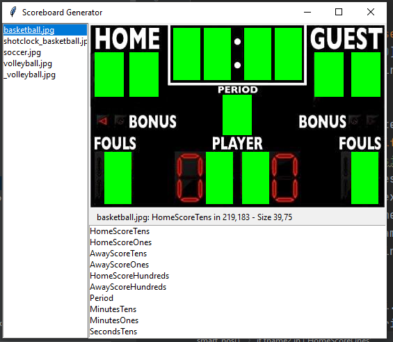

# OCR_Simulator

### Overview
OCR_Simulator is a Python project made to simulate a scoreboard visual on demand

### Requirements
Use the package manager [pip](https://pip.pypa.io/en/stable/) to manually install the following packages:\
Flask==1.1.2\
flask_expects_json==1.5.0\
Pillow==8.1.0\
requests==2.25.1
```bash
pip install foobar
```

Or run:
```bash
pip install -r requirements.txt
```


## Server
Run *server.py* to run the server\
Edit *server_configurations.py* to configure settings of the server\
*OCRSIM.postman_collection.json* contains examples of the endpoints and JSON you need.\
Note: All Set endpoints requires 'POST' request, while the other uses GET 
### endpoints:
#### server control commands
* \commands\shutdown\
Shutdown Server. Requires the server's secret in json.\
* \commands\player\
Run the scoreboard 'video player' (see player.py)\
"zoom": (int) zoom level (2-3) \
"debug": (bool) use if you want to play saved event\
"top": (bool) always on top\
#### scoreboard special commands
* \init\
Initialize scoreboard settings by sport type. You can turn on 'debug' and change the 'listen_port' that .\
*"scoreboard_id": (str) sport type\
"shotclock": (bool) enable 'shotclock' if you have a shot-clock or need a higher refresh rate (0.5 instead of default 1 sec)\
"debug": (bool) enable debug for full log (saved as *debug.txt*)\
"secret": (str) enter a string to lock the use of your scoreboard without a valid 'secret' field in future requests.\
if you set 'IP' as the secret value, the request is approved only if matched the IP from this init request.\
"font": (int) choose font folder (0-9).\
"listen_port": (int) port to be used by main.py to communicate with the server
* \commands\on\
Turn on the scoreboard
* \commands\off\
Turn off scoreboard (reset values to 0)
* \commands\quit\
End Scoreboard 'event'
* \commands\secretoverride\
"new_secret": (str) new secret for scoreboard (string only).
#### scoreboard score values
* \setClock\
"minutes": (int) 0-99\
"seconds": (int) 0-59\
"direction": (str) "up"/"down"
* \startClock\
"minutes": (int) 0-99\
"seconds": (int) 0-59\
"direction": (str) "up"/"down"
* \stopClock\
note: will also stop shotClock
* \setShotClock\
*"seconds": (int) up to 24
* \startShotClock\
"seconds": (int) up to 24
* \stopShotClock
* \setPeriod\
*"period": (int) 0-9
* \setTeamScore\
"homeScore": (int)\
"awayScore": (int)
* \setFouls\
"homeFouls": (int) 0-9\
"awayFouls": (int) 0-9


## main.py ##
The scoreboard 'engine', getting data from server and using image_generator\scoreboard_image.py to generate the images.\
Running a scoreboard on *debug* mode will add logs and will save all images to another folder named by sport-type (scoreboard-id), \
this allows a 'replay' of the event when needed (see player.py *debug* for more info)

## scoreboard_image.py ##
The graphical 'engine', rendering the scoreboard images for player.py, the scoreboard 'video player'

## player.py ##
The scoreboard 'video player', can run with zoom, on live or saved events.\
Note thar the player will delete unneeded files from 'live' unless it is running on debug mode\
Running the player on *debug* mode allows you to play saved events 

## Additional
### Scoreboard
Run *scoreboard_setup.py* to create or edit scoreboards. Press F1 for help.\
Load an image (its name should be the sport-type name)\
Choose fields and place them on the board\
Press Return to save\
\
\
Once you have the scoreboard folder set, put a copy of all digits (0-9.png) there. 

### sb_event.py ##
Init a basketball Scoreboard and send pre-defined commands to activate all fields and digits

### test.py ##
Init a Scoreboard and send random commands to simulate real event behavior